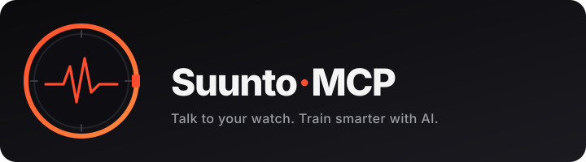

<p align="center">
  
</p>

# Suunto MCP

[](https://mcptoplist.com/server/glama%2Fgooglarz%2Fsuunto-mcp)

[](https://github.com/googlarz/suunto-mcp/actions/workflows/ci.yml)
[](LICENSE)
[](https://glama.ai/mcp/servers/googlarz/suunto-mcp)

**Ask Claude anything about your training.** Suunto MCP connects your Suunto watch data to Claude so you can just talk to your data instead of clicking through dashboards.

> *Built by a Suunto user who wanted to ask "how was my last long run?" and get a real answer with numbers — and to feed live training data into a personal AI coach.*

> 🏃 **For regular Suunto users:** Suunto's API docs say access is for commercial partners only — **that's not the full picture.** Private users get access too. It just takes **3–4 weeks** for approval after you apply. Submit, wait, enjoy. Don't let that disclaimer stop you. ✅

---

## What you can do

Once it's set up, just ask:

- *"How many kilometers did I run this month?"*
- *"Compare my last three long runs — has my heart-rate drift improved?"*
- *"Pull the GPX of yesterday's trail run and write a short journal entry."*
- *"What's my average resting HR trend over the last two weeks?"*
- *"Summarize my training week in the style of a coaching report."*
- *"I've been feeling off — how do my recovery scores compare to last month?"*
- *"Find every workout where I averaged above 160 bpm."*
- *"Which of my runs this year had the most elevation?"*

Claude figures out what data to pull. You just ask.

---

## 🤖 Don't want to do this yourself? Let Claude Code install it

If you already have [Claude Code](https://claude.ai/code), you don't need to run a single terminal command. Just open it and say:

> *"Please install and set up suunto-mcp from https://github.com/googlarz/suunto-mcp"*

Claude Code will clone the repo, run all the install commands, walk you through the apizone signup step by step, and add everything to your Claude Desktop config — on its own. That's exactly how this project's author set it up: no manual terminal work.

You'll still need to create the apizone account and click Authorize yourself (Claude can't enter your passwords), but it'll tell you exactly what to do and when.

**If you want to do it manually, keep reading.**

---

## What you need

Before starting, make sure you have:

- [ ] **A Suunto watch** synced to the Suunto app (any modern model — Race, Vertical, 9 Peak, 5 Peak, Ocean, etc.)
- [ ] **Claude Desktop** (or another MCP-compatible AI app)
- [ ] **Node.js** — free, [download here](https://nodejs.org), choose the "LTS" version
- [ ] **Git** — free, [download here](https://git-scm.com/downloads)
- [ ] **~5 min to submit** + 3–4 week wait for Suunto approval + ~15 min to install

Once it's done, you never redo it.

---

## Setup

The setup has three parts:

1. **Register with Suunto's developer portal** — tells Suunto your app is allowed to read your data
2. **Install and configure** — gets the software running on your computer
3. **Connect to Claude** — lets the AI find and use it

---

### Part 1: Register with Suunto's developer portal (~5 min to submit, then wait 3–4 weeks)

Suunto has a free developer portal called **apizone** where you register apps that can access your data. You'll create an account, subscribe to the data plan, and register a small "app" — don't worry, there's nothing to build, it's just a name and a password you make up.

#### Step 1: Create your apizone account

Go to [apizone.suunto.com](https://apizone.suunto.com) and sign up or sign in.

**Use the same email you use for the Suunto app.** If you have a Sports Tracker account, that works too — it's the same login system.

#### Step 2: Subscribe to the Developer API

After signing in, follow the [How to start](https://apizone.suunto.com/how-to-start) guide — it walks you through subscribing to the **Developer API**. This is free and gives you access to your workout history.

> **Heads up:** Suunto's website states that API access is only for commercial partners — ignore that. Private users do get access, it just takes **3–4 weeks** for the subscription to be approved. Submit it and wait. It will come through.

> You may see other products like "Sleep API", "Recovery API", "Daily Activity API". Skip those for now — the Developer API is enough to get started. You can add the others later if you want sleep and recovery data in Claude.

---

> ⏳ **Stop here and wait.** Once you've subscribed, Suunto needs to approve your request. This takes **3–4 weeks**. You'll get an email when it's done. Come back to Steps 3–4 only after your subscription shows as **Active** in your apizone profile.

---

#### Step 3: Register your app *(do this after approval)*

You're going to tell Suunto: "I have a small program, here's its name and a secret password — please let it read my data."

1. Go to your [apizone profile page](https://apizone.suunto.com/profile)
2. Scroll down to **OAuth application settings**
3. Fill in the form:

   | Field | What to enter |
   |-------|--------------|
   | **App name** | `suunto-mcp` (or anything you like) |
   | **Client secret** | Make up a unique password — something only you'd know, e.g. `alice-suunto-2026` with your own name. Write it down. Don't use this exact example. |
   | **Redirect URI** | `http://localhost:8421/callback` — copy this **exactly** |

4. Click **Save**

After saving, the form shows a **Client ID** — a long code that Suunto generated for you. Copy it.

> **What are these three things?**
> — **Client ID**: your app's username, generated by Suunto
> — **Client Secret**: your app's password, chosen by you
> — **Redirect URI**: where Suunto sends you back after you approve access — must match exactly, typos break it
>
> The Client Secret is never shown again after you save. If you forget it, just set a new one in the same form.

#### Step 4: Get your subscription key *(do this after approval)*

The subscription key is a second passcode that goes on every data request. Here's how to find it:

1. Still on the [apizone profile page](https://apizone.suunto.com/profile)
2. Scroll to the **Subscriptions** section
3. Your Developer API subscription is listed there. Next to it you'll see a **Primary Key** — click the button next to it to reveal it, then copy the key.

**Save all three values** before continuing — you'll need them in Part 2:
- Client ID (from the OAuth app form above)
- Client Secret (the password you made up)
- Subscription Key (from the Subscriptions section)

---

### Part 2: Install and configure (~10 min, after Suunto approves you)

#### Step 5: Download the code

Open **Terminal** on Mac (press ⌘Space and type "Terminal") or **Command Prompt** on Windows. Then run these commands one at a time:

```bash
git clone https://github.com/googlarz/suunto-mcp
cd suunto-mcp
npm install
npm run build
```

This downloads the code, installs what it needs, and builds it. Takes 1–2 minutes. If you see any errors, check the [Troubleshooting](#troubleshooting) section.

#### Step 6: Add your credentials

You'll create a file called `.env` in the suunto-mcp folder and put your three values in it.

**On Mac:**
```bash
cp .env.example .env
open -e .env
```

This copies the template and opens it in TextEdit. Replace each placeholder with your actual values, then save and close.

**On Windows:**
```bash
copy .env.example .env
notepad .env
```

The file looks like this — replace the parts after the `=` signs:

```
SUUNTO_CLIENT_ID=your-client-id-here
SUUNTO_CLIENT_SECRET=your-client-secret-here
SUUNTO_SUBSCRIPTION_KEY=your-subscription-key-here
```

Save and close the file.

#### Step 7: Pair your Suunto account

```bash
npm run auth
```

Here's exactly what happens:

**① Terminal** — you see a long URL printed and the message "Opening Suunto authorization in your browser…"

**② Browser opens** — Suunto's login page appears. It looks identical to the Suunto app login: email + password fields at the top, then "Sign in with Apple" and "Sign in with Facebook" below. Sign in with whichever you use.

**③ Permissions screen** — after logging in, a screen appears asking you to approve access for "suunto-mcp". It lists what the app will be able to read (your workouts). Click **Authorize**.

**④ Browser confirmation** — the page shows: *"Suunto MCP connected. You can close this tab."*

**⑤ Terminal confirmation** — prints: *"Paired successfully. Tokens saved."*

Done — you won't need to do this again. The connection stays active and renews itself automatically.

> **Browser didn't open automatically?** Copy the long URL from the terminal and paste it into your browser manually.

#### Step 8: Check everything is working

```bash
npm run doctor
```

This runs a health check. You should see output like:

```
Suunto MCP — health check

  ✓  Node version             20.18.0 (require ≥ 20)
  ✓  Credentials              client_id, client_secret, subscription_key set
  ✓  Network reachability     reachable
  ✓  Pairing                  paired (user: your-username), token expires in 47 min
  ✓  API probe (workouts)     received 1 workout
```

If any line shows ✗, the message tells you exactly what to fix. Resolve any issues before moving on.

---

### Part 3: Connect to Claude Desktop (~5 min)

Now you'll tell Claude Desktop where to find Suunto MCP.

#### Step 9: Open the Claude config file

Open this file in a text editor (create it if it doesn't exist yet):

- **Mac:** `~/Library/Application Support/Claude/claude_desktop_config.json`
- **Windows:** `%APPDATA%\Claude\claude_desktop_config.json`

**Quick way on Mac** — run this in Terminal:
```bash
mkdir -p ~/Library/Application\ Support/Claude && open -e ~/Library/Application\ Support/Claude/claude_desktop_config.json
```

**Quick way on Windows** — run this in Command Prompt:
```
notepad "%APPDATA%\Claude\claude_desktop_config.json"
```
(If it asks "file not found — create it?", click Yes.)

#### Step 10: Add Suunto MCP

First, find the actual path to the suunto-mcp folder. In Terminal, while inside the folder, run:

```bash
pwd
```

It'll print something like `/Users/yourname/suunto-mcp`. Copy that.

Now paste the following into the config file. Replace `/Users/yourname/suunto-mcp` with the path you got from `pwd`, and replace the credential placeholders with your actual values.

> **If the file already has other servers configured**, don't replace the whole file — just add the `"suunto"` section alongside them. The structure must be valid JSON, so keep all the curly braces balanced. When in doubt, compare your file to the example below.
>
> **If the file is empty**, paste the whole block as-is.

```json
{
  "mcpServers": {
    "suunto": {
      "command": "node",
      "args": ["/Users/yourname/suunto-mcp/dist/index.js"],
      "env": {
        "SUUNTO_CLIENT_ID": "your-client-id",
        "SUUNTO_CLIENT_SECRET": "your-client-secret",
        "SUUNTO_SUBSCRIPTION_KEY": "your-subscription-key"
      }
    }
  }
}
```

Save the file.

#### Step 11: Test it

Quit Claude Desktop and reopen it. Then ask:

> *"What was my most recent workout?"*

If Claude answers with your actual sport, date, and distance — you're all set!

---

## Example conversation

```
You:    Compare my last three long runs. Has my heart-rate drift improved?

Claude: Looking up your workouts…
        Found 3 runs over 90 minutes in the last 6 weeks:
          • Apr 12 — 22.4 km, 2h09, avg HR 148, last-30min drift +6 bpm
          • Apr 19 — 24.0 km, 2h21, avg HR 144, last-30min drift +4 bpm
          • Apr 26 — 25.1 km, 2h28, avg HR 142, last-30min drift +2 bpm
        Drift is trending down despite slightly longer runs — your aerobic
        base is improving. Pace at the same HR is also ~3 s/km faster.
```

---

## What data is available

| Category | What you can ask about | Requires |
|----------|----------------------|---------|
| **Workouts** | Any recorded activity — runs, hikes, rides, swims, ski tours. Distance, time, heart rate, pace, elevation, GPS route, power. | Developer API *(already subscribed)* |
| **Sleep** | Sleep duration, stages (light/deep/REM), sleep score. | Sleep API subscription on apizone |
| **Recovery** | HRV, recovery status, stress balance. | Recovery API subscription on apizone |
| **Daily activity** | Steps, calories, 24/7 heart rate. | Daily Activity API subscription on apizone |

To add sleep, recovery, or daily activity: go back to [apizone.suunto.com](https://apizone.suunto.com), find each product, and subscribe. Then run `npm run doctor` to confirm they're active.

---

## Troubleshooting

**Always run `npm run doctor` first** — it pinpoints most problems automatically.

| What you see | What it means | How to fix it |
|---|---|---|
| Claude returns an error or nothing | Something isn't connected yet | Run `npm run doctor` and fix any lines with ✗ |
| Empty workout list | Watch hasn't synced recently | Open the Suunto app on your phone and wait for the sync to complete |
| "Not authenticated" | The pairing step didn't finish | Run `npm run auth` again |
| You logged in but nothing happened | The browser tab closed or timed out before Suunto confirmed | Close all Suunto tabs and run `npm run auth` again — click Authorize promptly |
| "Token request failed" or "400 error" | Client Secret or Redirect URI don't match apizone | Go to apizone → profile → OAuth application settings and confirm both values match exactly |
| "401" error on every request | Subscription key is wrong or incomplete | Go to apizone → profile → Subscriptions, reveal and re-copy the Primary Key |
| "403 Forbidden" on workouts | Developer API subscription isn't active | Sign in to apizone and confirm it's listed as Active |
| Sleep / recovery / activity returns "not found" | Those need separate subscriptions | Go to apizone and subscribe to the Sleep, Recovery, or Daily Activity API |
| Got an SSL error after Apple sign-in | Known Suunto quirk with Apple login | Close the error tab, go back to the auth URL the terminal printed, and continue |
| "State mismatch" error | A second auth flow started before the first finished | Close all auth-related tabs and run `npm run auth` fresh |
| `npm run build` failed with an error | Node.js version too old or not installed | Run `node --version` — it must be 20 or higher. Reinstall from [nodejs.org](https://nodejs.org) |
| Terminal says "EADDRINUSE" or port in use | Something else is using port 8421 | Restart your computer, or run `lsof -i :8421` to see what's using it |

---

## FAQ

**Is this safe? Will Suunto lock my account?**
Suunto built this API specifically for people to connect their own tools — it's explicitly allowed. You're using it exactly as intended.

**Is my data leaving my computer?**
Your data travels directly between your computer and Suunto's servers. Suunto MCP is just the bridge. When Claude asks about your workouts, it goes: Claude → Suunto MCP (on your machine) → Suunto's servers → back. No third-party services see your data.

**Which Suunto watches work?**
Any watch that syncs to the Suunto app: Race, Vertical, 9 Peak Pro, 9 Peak, 5 Peak, Wing, Ocean, and older models. If it appears in your Suunto app, it works here.

**Do I need to do anything when I record a new workout?**
No. Just ask Claude — it always pulls live data from Suunto.

**What if I want to disconnect and stop using this?**
See [Disconnecting](#disconnecting) below. You can fully revoke access in under a minute.

**Can I use this with AI apps other than Claude?**
Yes — anything that supports MCP: Claude Code, Cursor, Windsurf, and others.

**My Suunto app username is different from my email — which do I use?**
Use your email address to sign in to apizone. Your username will appear once you're authenticated.

---

## Privacy

- All data flows **directly between your computer and Suunto's servers**. No third-party servers, no analytics.
- Your login credentials are stored locally at `~/.suunto-mcp/tokens.json` — not uploaded anywhere.
- Suunto shows your connected app as "suunto-mcp" in apizone → profile → Authorized applications. You can revoke it there at any time.
- The AI only sees data it explicitly requests for your question — not your entire history at once.

---

## Disconnecting

To fully remove access:

1. Log in to [apizone.suunto.com](https://apizone.suunto.com) → profile → **Authorized applications** → remove suunto-mcp. Suunto immediately stops honoring the connection.
2. Delete local credentials:
   ```bash
   rm -f ~/.suunto-mcp/tokens.json
   ```
3. Remove the `"suunto"` block from your Claude config and restart Claude.

---

## Pairs well with health-skill

If you use [googlarz/health-skill](https://github.com/googlarz/health-skill) — a Claude skill for symptom triage and health Q&A — Suunto MCP gives it a live feed of your training, sleep, and recovery data. Together they can answer questions like *"given my recovery scores this week, should I keep tomorrow's interval session?"* with real numbers.

---

## Advanced

<details>
<summary>Using with Claude Code instead of Claude Desktop</summary>

Edit `~/.claude/mcp_config.json` and add the same `"suunto"` block from Step 10. Then run `claude mcp list` to verify it's loaded.

</details>

<details>
<summary>CLI — query your data from the terminal</summary>

After building, you can query Suunto data directly without Claude:

```bash
suunto-mcp list-workouts --limit 10
suunto-mcp get-workout <workoutKey>
suunto-mcp export-workout-gpx <workoutKey> > route.gpx
suunto-mcp get-sleep 2026-04-20
suunto-mcp list-recovery --from 2026-04-01 --to 2026-04-30
```

All output is JSON — pipe into `jq` for filtering.

</details>

<details>
<summary>Webhooks — get notified the moment a workout syncs</summary>

```bash
npm run webhook
```

Starts an HTTP receiver on port 8422 that logs workout events as they arrive. Expose it to the internet (cloudflared, ngrok, your own server) and register the URL in apizone → webhooks.

Most users can skip this — asking Claude on demand is simpler.

</details>

<details>
<summary>Keychain — store credentials more securely</summary>

To store your Suunto login tokens in your OS keychain (macOS Keychain, Windows Credential Manager) instead of a file:

```bash
SUUNTO_TOKEN_STORAGE=keychain npm install @napi-rs/keyring
SUUNTO_TOKEN_STORAGE=keychain npm run auth
```

</details>

<details>
<summary>All available tools (reference)</summary>

Claude picks the right tool automatically — you don't need to know these. For the curious:

**Workouts**

| Tool | What it does |
|------|-------------|
| `list_workouts` | Recent workouts, filter by date or sport |
| `get_workout` | Full summary for one workout |
| `get_workout_samples` | Time-series: HR, pace, altitude, power, GPS per second |
| `get_workout_fit` | Raw FIT file decoded to structured data |
| `export_workout_gpx` | GPX route export for maps, Strava, route planning |

**24/7 health** *(requires individual product subscriptions on apizone)*

| Tool | What it does |
|------|-------------|
| `get_daily_activity` / `list_daily_activity` | Steps, calories, daily heart rate |
| `get_sleep` / `list_sleep` | Sleep stages, duration, score |
| `get_recovery` / `list_recovery` | Recovery score, HRV, stress balance |
| `get_daily_activity_statistics` | Aggregated daily stats over a date range |

</details>

---

## Credits

- [Suunto APIzone](https://apizone.suunto.com/) — for opening their API to everyone
- [Model Context Protocol](https://modelcontextprotocol.io) — the standard this speaks
- [`fit-file-parser`](https://www.npmjs.com/package/fit-file-parser) — FIT binary decoding

## License

MIT — use it, fork it, improve it.
